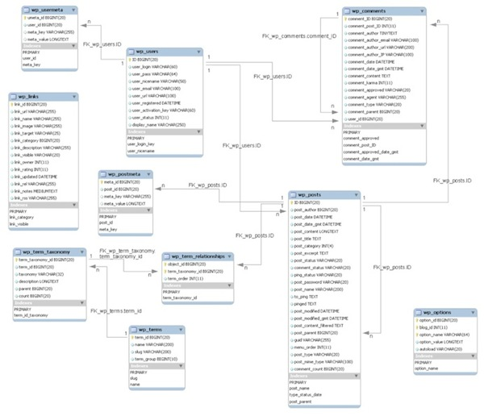
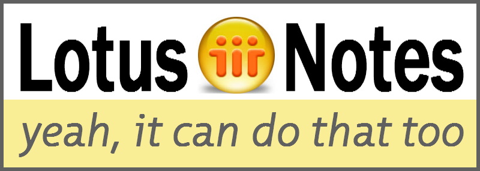
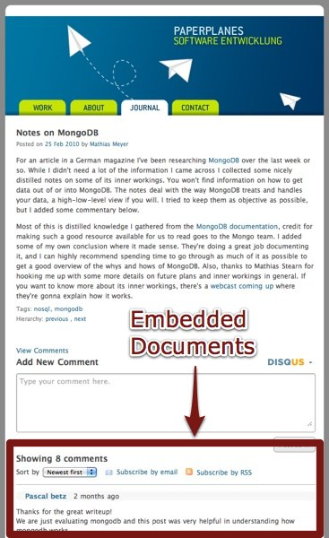

!SLIDE

# Why Documents? #

!SLIDE center

!SLIDE

## The Web is not relational. ##

!SLIDE

## Data is unstructured. ##

!SLIDE

## Data is loosely related. ##

!SLIDE

## Some data belongs together. ##

!SLIDE

## Migrating schemas is painful. ##

!SLIDE

## Schemas should grow or shrink on demand. ##

!SLIDE

## The idea of documents isn't new. ##

!SLIDE center

!SLIDE

## The Web is full of documents. ##

!SLIDE center

!SLIDE center

!SLIDE center

!SLIDE center

!SLIDE center

!SLIDE

## All that data belongs together. ##

!SLIDE

## Impossible with relational data structures. ##

!SLIDE

## Documents bring flexibility. ##

!SLIDE

## Related data can be stored together. ##

!SLIDE

# The Web ♥ Documents #
