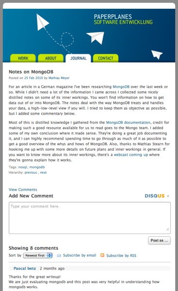

!SLIDE

# Why Documents? #

!SLIDE center

!SLIDE

## The Web is not relational. ##

!SLIDE

## Unstructured data. ##

!SLIDE

## Loosely linked data. ##

!SLIDE

## Data belongs together. ##

!SLIDE

## The Web is full of documents. ##

!SLIDE center

!SLIDE center

!SLIDE center

!SLIDE center

!SLIDE center

!SLIDE

## This data belongs together. ##

!SLIDE

## Complex with relational structures. ##

!SLIDE

## Documents bring flexibility. ##

!SLIDE

## Related data in one place. ##

!SLIDE

# The Web ♥ Documents #
