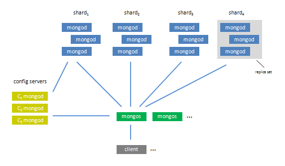

!SLIDE

# The Web ♥ Diversity #

!SLIDE

# NoSQL is about choice. #

<a href="http://talks.jan.io/buzzwords-2010.html#present">Jan Lehnardt, 2010</a>

!SLIDE

## Not every tool is right for every job. ##

!SLIDE

## Relational databases are proof. ##

!SLIDE bullets incremental

# Document Databases #

!SLIDE bullets incremental

* CouchDB
* MongoDB
* Riak

!SLIDE center

!SLIDE bullets incremental

# CouchDB #

* "Made of the web"
* Uses HTTP, JSON, JavaScript
* Queries using Map/Reduce
* P2P-like replication

!SLIDE bullets incremental

# Riak #

* HTTP interface
* Simple data model
* Instant scale out, just add more nodes 

!SLIDE bullets incremental

# MongoDB #

* BSON (binary JSON)
* Dynamic queries
* Index support
* Atomic operations

!SLIDE

# MongoDB #

## Relational databases meet the web. ##

!SLIDE

# Differences #

!SLIDE

# Querying Data #

!SLIDE bullets incremental

# CouchDB #

* Map/Reduce
* Precalculated views
* Built using JavaScript or Erlang
* Brain-twisting

!SLIDE bullets incremental

# Riak #

* Map/Reduce
* Calculated on demand
* Built using JavaScript or Erlang

!SLIDE bullets incremental

# MongoDB #

* Rich, dynamic queries
* SQL-ish
* Secondary Indexes
* Map/Reduce

!SLIDE

# Scaling Out #

!SLIDE bullets incremental

# CouchDB #

* Replicate anywhere, anytime
* P2P

!SLIDE bullets incremental

# Riak #

* Hash ring cluster
* No special nodes
* Nodes can be added any time
* Scales up with added nodes

!SLIDE bullets incremental

# MongoDB #

* Replication
* Replica Sets
* Auto-sharding

!SLIDE bullets incremental

# Replication #

* Initial sync
* Stream changes from master
* Big improvement over MySQL replication

!SLIDE bullets incremental

# Replica Sets #

* A cluster of N nodes
* One is the master
* New master is elected on outage
* Automatic failover and recovery
* Can be tuned for location

!SLIDE bullets incremental

# Replica Sets #

* Coming in MongoDB 1.6
* Wicked cool!

!SLIDE center

# Auto-Sharding #

!SLIDE bullets incremental

# Auto-Sharding #

* Config servers
* Routing processes
* Shards (Replica Sets)
* Lots of moving parts

!SLIDE 

# Durability #
## Or: How safe is my data? ##

!SLIDE bullets incremental

# CouchDB #

* Durability on a single host
* Data is never updated, only appended
* Written data is always consistent
* Required compaction

!SLIDE bullets incremental

# Riak #

* Durability through replication
* Any node can be a replica for any node
* Tunable per storage backend

!SLIDE bullets incremental

# MongoDB #

* No single-server durability
* Replicate, replicate, replicate
