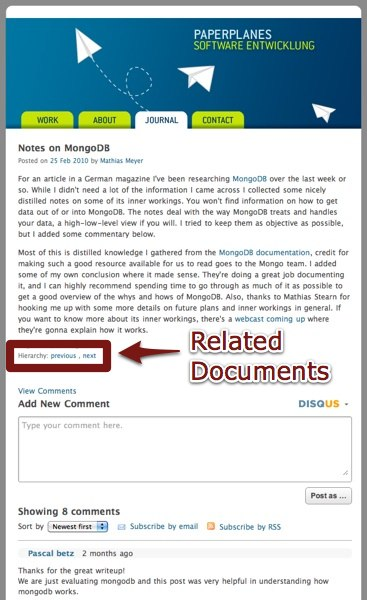

!SLIDE center

!SLIDE

## What makes MongoDB unique? ##

!SLIDE

## All relevant data can be updated independently. ##

!SLIDE center

!SLIDE javascript

    @@@ javascript

    db.posts.update(
      {name: "Notes on MongoDB"},
      {$push: {tags: 'mongodb'}}
    );

!SLIDE center

!SLIDE javascript

    @@@ javascript
    post.previous = DBRef(previousPost)

!SLIDE center

!SLIDE javascript

    @@@ javascript
    db.posts.update(
      {name: "Notes on MongoDB"},
      {
        $push: {comments:
          {
            author: "Pascal betz",
            comment: "Thanks for the great..."
          }
        }
      }
    )

!SLIDE center

# Additional metadata. #

!SLIDE javascript

    @@@ javascript
    db.posts.update(
      {name: "Notes on MongoDB"},
      {$inc: {views: 1}}
    )

!SLIDE

# Dynamic queries #

!SLIDE javascript

    @@@ javascript
    db.find({name: "Notes on MongoDB"})

!SLIDE javascript

    @@@ javascript
    db.find({$gt: {views: 10}})

!SLIDE

## Just make sure your data is properly indexed. ##

!SLIDE

## No other document store can do adhoc queries. ##

!SLIDE center

!SLIDE javascript

## Only access certain attributes: ##

    @@@ javascript
    db.find(
      {name: "Notes on MongoDB"},
      {'contents': 1}
    )

!SLIDE center

!SLIDE bullets incremental

## It's dead-simple to start off. ##

* And to scale up.

!SLIDE bullets incremental

## Development speed. ##

* Wheeeeee!

!SLIDE bullets incremental

## The best of both worlds: ##

* Queries and indexes from relational databases
* Schemaless documents
* Some scaling features sprinkled on top
